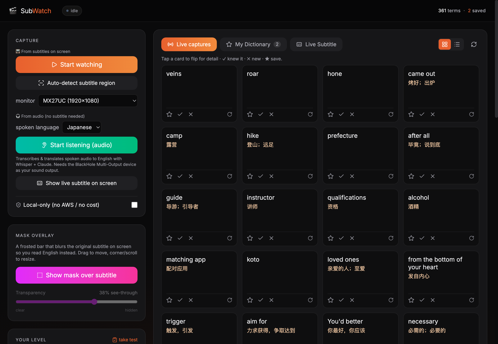

<h1 align="center">🎬 SubWatch</h1>

<p align="center"><b>Watch anything. Learn English while you do.</b></p>

<p align="center">
  
  
  
  
  
  
</p>

<p align="center">
  
</p>

SubWatch turns **any** video — a movie, a show, a YouTube clip, anything on your
screen — into an English-learning session. It reads the **subtitles off the screen**
(Apple Vision OCR) *or* transcribes the **spoken audio** live with local Whisper,
translates non-English to English, and uses Codex to mine the words and
idioms that are actually hard *for you* into a spaced-repetition dictionary.

No plugins, no subtitle files, no specific player — it works with Netflix,
Bilibili, YouTube, local files in VLC/IINA, all the same.

### ✨ Highlights

- **📺 Subtitle mode** — on-device OCR of whatever's on screen; captures hard words with the full sentence + Chinese line as context.
- **🎧 Audio mode** — for videos with *no* subtitle: live transcribe + translate (Japanese, Chinese, Korean, Spanish… → English) and a live on-screen caption overlay.
- **🧠 Smart difficulty** — an LLM picks words that are genuinely hard *for your level* (not just rare ones); take a quick placement test and mark ✓/✗ to auto-calibrate.
- **⭐ Personal dictionary** — star words to keep; flip-card grid, audio pronunciation, Anki export.
- **🪟 Frosted mask overlay** — blur the original subtitle on screen so you read English instead (adjustable transparency).
- **🎛 Dashboard + menu-bar app** — control everything from a browser panel or the macOS menu bar.
- **🔒 Local-only mode** — disables Codex and runs only OCR, Whisper, and word lists.

> **Platform:** macOS (Apple Silicon or Intel). The OCR engine, overlays and
> menu-bar app use Apple's Vision/Cocoa frameworks. See *Running on another
> computer* below for the portable bits and what a Windows port would need.

## Install

**macOS:**
```bash
git clone https://github.com/canjianchen/subwatch.git
cd subwatch
./setup.sh        # installs deps, fetches UI libs, builds the OCR helper
```

Then grant **Screen Recording** (and, for audio mode, **Microphone**) to your
terminal in *System Settings → Privacy & Security*, and quit/reopen it.

**Windows** (PowerShell):
```powershell
git clone https://github.com/canjianchen/subwatch.git
cd subwatch
powershell -ExecutionPolicy Bypass -File .\setup.ps1   # installs deps + fetches UI libs
.\subwatch.bat panel
```

Then add the OCR language pack for the subtitle language you watch: *Settings →
Time & Language → Language* → add e.g. **Chinese (Simplified)**, then add the
optional **"Optical character recognition"** feature. See **Running on Windows**
below and `AGENTS.md` for the full platform matrix and gotchas.

> Language-model features use the locally installed Codex CLI and its saved login.
> Without a Codex login, SubWatch automatically falls back to local-only mode.

## Quick start

```bash
./subwatch panel        # open the dashboard, then drive everything from there
```

Or from the command line:

```bash
./subwatch autodetect 1 # find the subtitle band on monitor 1 (a video must be playing)
./subwatch watch        # 📺 subtitle mode — capture hard words as you watch
#  …or, for video with no subtitle:
./subwatch listen       # 🎧 audio mode — live transcribe + translate + capture
./subwatch review       # study the captured words (spaced-repetition flashcards)
```

## Commands

| Command | What it does |
|---|---|
| `subwatch panel` | Open the web dashboard — control everything live in the browser. |
| `subwatch menubar` | Run the macOS menu-bar app (quick toggles, no browser). |
| `subwatch watch` | 📺 Subtitle mode: OCR the screen and capture hard words. Ctrl-C to stop. |
| `subwatch listen` | 🎧 Audio mode: transcribe + translate spoken audio → capture. `--list` shows devices. |
| `subwatch autodetect [N]` | Auto-find the subtitle band on monitor N (a video must be playing). |
| `subwatch region` | Manually drag-select the subtitle area instead. |
| `subwatch overlay` | Frosted mask bar that blurs the on-screen subtitle. |
| `subwatch meeting` | 🎙 Meeting Mode: capture live Zoom captions → saved transcript + AI notes + Q&A. |
| `subwatch meetings` | List captured meetings. |
| `subwatch review` | Flashcard review app (spaced repetition). |
| `subwatch enrich` | Add LLM definitions + translations to captured terms. |
| `subwatch audio` | Generate pronunciation clips for captured terms. |
| `subwatch notes` | Export to `notes/vocabulary.md` + `notes/anki_import.csv`. |
| `subwatch level <n>` / `smart on\|off` / `local on\|off` | Tune difficulty / smart capture / local-only. |
| `subwatch stats` · `config` | Vocabulary counts · print settings. |

> Note: `mode` controls what the **capture log shows** as a live study transcript.
> SubWatch reads subtitles; it does not paint over the video player itself. To hide
> a subtitle line *in the player*, turn off that track in the player and let
> SubWatch supply the other language in its log / notes.

## How "hard" is decided

Each English word is looked up in a 10,000-word frequency list. A word is captured
when it's rarer than your `rarity_threshold` (default 3000) or not in the list at
all. Naive de-inflection maps `running`→`run`, `flabbergasted` stays rare, `the`
is ignored. Tune in `data/config.json`:

```json
{
  "display_mode": "hide_chinese",
  "capture_interval": 1.5,
  "rarity_threshold": 3000,
  "min_word_length": 4,
  "min_confidence": 0.3,
  "capture_region": [x, y, w, h]
}
```

**Higher** `rarity_threshold` = stricter (only rarer words captured). Set it with
`subwatch level <n>`: ~3000 = easy (captures everyday words), ~7000 = advanced
(skips common words like *kill*/*shoot*, keeps *splattered*), ~9000 = expert.

## Review

`subwatch review` opens a flashcard window:

- **Front:** the word + the sentence you heard it in, with the word blanked out.
- **Reveal** (space) shows the definition, the Chinese subtitle line, and the full sentence.
- Rate **Again / Hard / Good / Easy** (keys 1–4) to schedule the next review (SM-2-lite).

## Files

```
subwatch/
  subwatch            control script (the CLI)
  bin/ocr_helper      compiled Swift Vision OCR helper
  src/
    ocr_helper.swift  Vision OCR (English + Chinese), local & free
    ocr.py            screen capture + OCR bridge
    detector.py       hard-word detection via frequency list
    watch.py          the capture loop
    store.py          SQLite vocabulary + spaced repetition
    review_app.py     Tkinter flashcard app
    enrich.py         optional Codex definitions/translations
    export_notes.py   markdown + Anki CSV export
    pick_region.py    drag-select the subtitle region
    config.py         config + paths
  data/
    common_words.txt  10k frequency list (hard-word baseline)
    config.json       your settings
  db/subwatch.db      your captured vocabulary
  notes/              exported study notes
```

## Hiding subtitles on screen (the mask overlay)

`subwatch overlay` (or the panel's **Start mask overlay**) shows a single opaque
black bar you place yourself:

- **drag** anywhere on the bar to move it
- **scroll** over it, or drag the **bottom-right corner ◢**, to resize
- **+ / −** keys to zoom bigger/smaller
- **red ⨯** (top-right) to close it

Place it over whichever subtitle line you want gone — there's just one generic bar,
so cover the Chinese, the English, or both lines (make it taller). It remembers its
size and position next time.

> macOS keeps *native-fullscreen* video in its own Space, so the overlay can't sit
> on top of true fullscreen. Watch in a **maximized window** instead.

## Audio mode (videos with no subtitle)

`subwatch listen` transcribes the spoken audio with local **Whisper** and — if it's
not English — translates it to English in one step, then captures hard words just
like the subtitle path. One-time setup so it can hear the video's sound:

1. **Install the virtual audio device** (done if you ran setup): `brew install blackhole-2ch`
2. **Load it** (driver needs the audio daemon reloaded once):
   `sudo killall coreaudiod`  (or log out / restart). BlackHole then appears as an audio device.
3. **Route the video's audio through it** so SubWatch can capture it *and* you can still hear it:
   - Open **Audio MIDI Setup** → create a **Multi-Output Device** containing both your
     speakers/headphones **and** BlackHole 2ch.
   - Set that Multi-Output as your Mac's output (System Settings → Sound → Output).
4. **Run it:** `subwatch listen --device BlackHole`  (use `--model small` for better accuracy,
   `--no-translate` if the audio is already English and you just want a transcript).

Models: `tiny`/`base` (fast, near-live) → `small`/`medium` (more accurate, more lag).

## 🎙 Meeting Mode (Otter-style notes for locked-down Zoom)

For meetings where you can't get the transcript afterward (e.g. a corporate Zoom with
saving/cloud features disabled): SubWatch reads Zoom's **live Caption (CC)** window into a
**permanent, timestamped, searchable transcript**, takes **live AI notes**, and lets you
**ask questions about the meeting** — during and after — like Otter.

```bash
# 1. In Zoom, turn on Live Caption (CC). (Optionally open "View Full Transcript".)
# 2. From the panel's Meeting tab, click "Start meeting capture"  (or: subwatch meeting)
# 3. Talk. The transcript, notes, and action items fill in live.
# 4. Click "Stop & summarize" → a post-meeting summary is generated and saved.
#    Ask questions any time in the chat box; export to Markdown from the transcript pane.
```

**How it captures (no audio routing needed):** primary source is the macOS **Accessibility
API** — it reads Zoom's caption text directly as exact strings (no OCR error, includes speaker
names, ~8 ms/poll). Grant **Accessibility** to your terminal/app once (System Settings →
Privacy & Security → Accessibility). If AX yields nothing it falls back to **OCR** of the
caption window, and finally to **audio→Whisper** (needs BlackHole).

**The AI** (notes, chat, post-meeting summary) runs through **Codex**, with a
Chain-of-Verification fact-check pass that scores the summary against the
transcript. The summary follows a battle-tested schema — overview, narrative, decisions,
structured action items `{action, owner, deadline}`, announcements, key points. Chat is
grounded in the transcript and refuses to invent. With Codex disabled (`local_only`), the transcript +
search + export still work fully offline; notes degrade to a simple extractive list.

**Privacy:** everything is local — the transcript lives in your own SQLite DB
(`db/subwatch.db`), nothing is uploaded except the text sent to Codex for notes/chat/summary
(skip even that with local-only mode). Only capture meetings you're permitted to, and check
your org's acceptable-use policy.

## Running on another computer

**Another Mac:** copy the `~/build/subwatch/` folder over, then
`pip3 install --user -r requirements.txt` (PyObjC for the overlay) and grant Screen
Recording permission. The compiled `bin/ocr_helper` is Apple-Silicon; on a different
Mac run `subwatch rebuild-ocr` once. Everything else is portable.

**Windows:** supported — see **Running on Windows** below. Subtitle capture,
review, notes, the panel, overlays and pronunciation are all wired up per-OS.
(Only the menu-bar app and Meeting Mode's *live capture* remain macOS-only.)

## Running on Windows

The Windows path is built in — you don't need to port anything. Setup:

```powershell
git clone https://github.com/canjianchen/subwatch.git
cd subwatch
powershell -ExecutionPolicy Bypass -File .\setup.ps1
.\subwatch.bat panel
```

What runs where (full table in `AGENTS.md`):

- **Subtitle mode** (`watch`) — screen grab via `mss` + on-device OCR via
  Windows' built-in `Windows.Media.Ocr` (free, local). Needs the OCR **language
  pack** for the subtitle language: *Settings → Time & Language → Language* → add
  the language → add the optional **"Optical character recognition"** feature.
- **Panel, review, notes, vocabulary, spaced-repetition** — identical to macOS.
- **Mask overlay** (`overlay`) — a borderless always-on-top Tkinter bar
  (`overlay_win.py`), same controls as the Mac version.
- **Pronunciation** (`audio`) — Windows SAPI (built in).
- **Audio mode** (`listen`) — local Whisper; route the video's sound through a
  virtual audio device (e.g. VB-CABLE) so it can be heard.
- **Codex is optional** — without a CLI login it runs local-only (OCR + review +
  notes + panel all work; smart grading/meeting AI are skipped).

**macOS-only, not on Windows:** the menu-bar app (`menubar`) and Meeting Mode's
*live Zoom caption capture* (it uses the macOS Accessibility API). A captured
meeting's transcript, AI notes, Q&A and export still view fine on Windows.

## Privacy

OCR and Whisper run locally. Optional language-model features send only their prompt
text to Codex; enable Local-only to keep every step offline.
